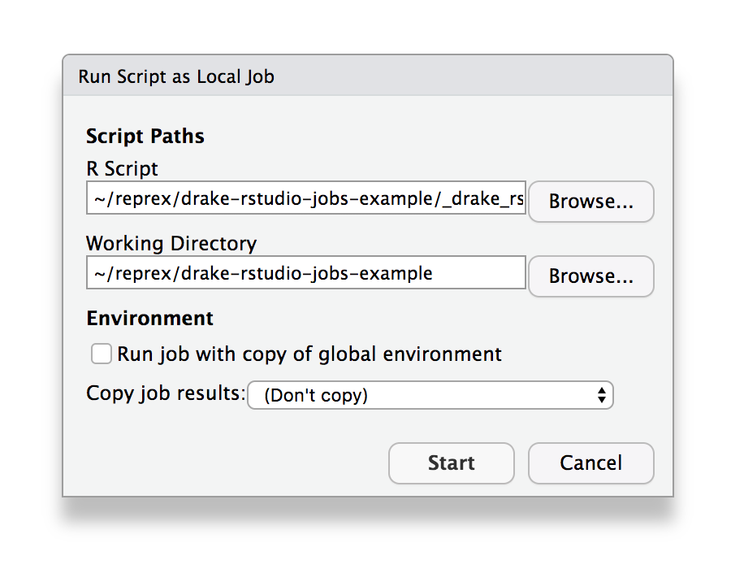

```{r setup, include=FALSE}
knitr::opts_chunk$set(eval = FALSE)
```

# Using drake with RStudio Background Jobs

## The Problem

I have a drake workflow with a long-running step that I want to build using the RStudio Job launcher. But without additional work, running `drake::make()` as an RStudio job invalidates targets that depend on functions sourced into the global environment. Running `drake::make()` or `drake::r_make()` from a standard environment _after_ running `make()` inside the RStudio job launcher will again invalidate old targets, including those just built by the job launcher.

The following demonstrates the issue but requires manual intervention due to the job launcher.

Utlimately, loading dependencies into a new environment instead of the global environment allows all import dependencies to be correctly discovered and tracked by drake, as [demonstrated at the end](#possible-resolution-source-function-dependencies-into-specific-environment).

## Process

Start with a clean project.

```{r}
if (dir.exists(".drake")) unlink(".drake", recursive = TRUE)
if (file.exists("data/mtcars.rds")) unlink("data/mtcars.rds")
```

The project (based on the [drake mtcars example](https://ropenscilabs.github.io/drake-manual/mtcars.html)), has a couple long-running targets, `regression1` and `regression2` using the `small` and `large` data sets.

```{r eval=TRUE}
source("_drake.R")
plan
```

In this example, the regression targets build quickly, but in my real-world use case they could be long-running model fits or cross validation steps that potentially take hours. Because I'd rather not lock up my console for that long, I would like to build these targets in the background using the RStudio Jobs launcher. To do this, I've created a small script called [_drake_rstudio-job.R](_drake_rstudio-job.R) that simply contains

```{r echo=FALSE, eval=TRUE, comment=""}
cat(readLines("_drake_rstudio-job.R"), sep = "\n")
```

Starting from a clean project:

```{r}
drake::r_outdated()
##  [1] "coef_regression1_large" "coef_regression1_small" "coef_regression2_large"
##  [4] "coef_regression2_small" "data"                   "large"                 
##  [7] "regression1_large"      "regression1_small"      "regression2_large"     
## [10] "regression2_small"      "report"                 "small"                 
## [13] "summ_regression1_large" "summ_regression1_small" "summ_regression2_large"
## [16] "summ_regression2_small"
```

Run `_drake_rstudio-job.R` in an RStudio background job.

<p align="center">

</p>

```
target data
target large
target small
target regression1_large
target regression2_large
target regression1_small
target regression2_small
```

And then save the cache log manually.

```{r}
cl <- drake::drake_cache_log()
readr::write_tsv(cl, "cache_log/01a-after-RStudio-job.log")
knitr::kable(cl)
```


|hash             |type   |name                 |
|:----------------|:------|:--------------------|
|a7afcfc52a180687 |target |data                 |
|a44bdd51b1e985e3 |import |import_data          |
|7b6504d4c0dcceab |target |large                |
|503a24ae76dad431 |import |knitr::knit          |
|e48820305a44c4d2 |import |file data/mtcars.csv |
|7a456ee58df699be |import |file report.Rmd      |
|db84c9f752635a13 |import |random_rows          |
|21935c86f12692e2 |import |reg1                 |
|69ade4b78f15a3f9 |import |reg2                 |
|e1501ed9d62b846e |target |regression1_large    |
|2a400716e73eac8f |target |regression1_small    |
|fe8ac4561279fb68 |target |regression2_large    |
|c0f94be64233efe8 |target |regression2_small    |
|9b31e33768015e24 |import |simulate             |
|78414659cd5e9997 |target |small                |

Run `_drake_rstudio-job.R` in an RStudio background job again.

```
All targets are already up to date.
```

Back in RStudio console, run 

```{r}
drake::r_make()
```

```
target data
target large
target small
target regression1_large
target regression2_large
target regression1_small
target regression2_small
target summ_regression1_large
target coef_regression1_large
target summ_regression2_large
target coef_regression2_large
target summ_regression1_small
target coef_regression1_small
target coef_regression2_small
target summ_regression2_small
target report
```

Notice that the targets we made in the RStudio job were re-made!

```{r}
cl <- drake::drake_cache_log()
readr::write_tsv(cl, "cache_log/01b-after-r_make.log")
```

But none of the hashes changed between the RStudio background job run and the `r_make()` job.

```{r eval=TRUE, message=FALSE}
bg <- readr::read_tsv("cache_log/01a-after-RStudio-job.log")
cs <- readr::read_tsv("cache_log/01b-after-r_make.log")

both <- dplyr::full_join(bg, cs, by = c("type", "name"), suffix = c(".bg", ".console"))
both <- dplyr::select(both, type, name, dplyr::everything())
knitr::kable(both)
```

If we had paused between the background job and the second make step, we would have seen the following:

```{r}
source("_drake.R")
deps_profile("data", config)
## # A tibble: 4 x 4
##   hash     changed old_hash         new_hash
##   <chr>    <lgl>   <chr>            <chr>
## 1 command  FALSE   40c2ded1562d6fda 40c2ded1562d6fda
## 2 depend   TRUE    ""               4f18907a711e6c41
## 3 file_in  FALSE   a0775797ef1a5066 a0775797ef1a5066
## 4 file_out FALSE   ""               ""

deps_target("data", config)
## # A tibble: 2 x 2
##   name            type
##   <chr>           <chr>
## 1 import_data     globals
## 2 data/mtcars.csv file_in
```

## Expected behavior

To see what I was expecting to happen, reset the project and repeat the process without using the RStudio Job Launcher.

```{r}
drake::clean()
drake::r_outdated()
```

```
##  [1] "coef_regression1_large" "coef_regression1_small" "coef_regression2_large"
##  [4] "coef_regression2_small" "data"                   "large"                 
##  [7] "regression1_large"      "regression1_small"      "regression2_large"     
## [10] "regression2_small"      "report"                 "small"                 
## [13] "summ_regression1_large" "summ_regression1_small" "summ_regression2_large"
## [16] "summ_regression2_small"
```

I'll use `callr::rscript()` as a replacement for what I expected to happen.

```{r}
callr::rscript("_drake_rstudio-job.R", show = TRUE)
```

```
target data
target large
target small
target regression1_large
target regression2_large
target regression1_small
target regression2_small
```

```{r}
drake::r_make()
```

```
target coef_regression2_small
target summ_regression1_large
target summ_regression1_small
target summ_regression2_large
target summ_regression2_small
target coef_regression1_large
target coef_regression1_small
target coef_regression2_large
target report
```
    

## Possible Cause: Differences in Global Environment

I think the cause of the target invalidating is related to some global environment shenaningans that happens in the RStudio job launcher.

The script [ls_GlobalEnv.R](ls_GlobalEnv.R) lists the global environment objects after sourcing [_drake.R](_drake.R). Running this script from the R console returns the following.

```{r, eval=TRUE, comment=""}
# In fresh session
callr::rscript("ls_GlobalEnv.R", show = TRUE)
```

But running the same script in a Local RStudio Job indicates that there are additional objects added to the global environment by the RStudio Job launcher.

```{r}
# Must be run manually in RStudio
rsjob <- new.env()
rstudioapi::jobRunScript("ls_GlobalEnv.R", workingDir = getwd(), exportEnv = "rsjob")
rsjob$ls_global
```

```
 [1] ".Random.seed"       "config"             "emitProgress"      
 [4] "import_data"        "plan"               "r_files"           
 [7] "random_rows"        "reg1"               "reg2"              
[10] "simulate"           "sourceWithProgress"
```

In particular, `emitProgress` and `sourceWithProgress`.


## Possible Resolution: Source function dependencies into specific environment

A possible solution (workaround?) is demonstrated in [_drake_env.R](_drake_env.R), where a specific environment is created to hold the project's function dependencies.

```{r}
drake_env <- new.env()

r_files <- fs::dir_ls("R")
purrr::walk(r_files, sys.source, envir = drake_env)
```

We then need to point drake to this environment in `drake_config()`, `make()`, etc. with the `envir` argument.

```{r}
config <- drake_config(plan, envir = drake_env)
```

Having done this, the plan is now made reproducibly using RStudio Jobs.

```{r}
drake::clean()
```

Run `_drake_env.R` in an RStudio background job

```
target data
target large
target small
target regression1_large
target regression2_large
target regression1_small
target regression2_small
```

and again save the state of the drake cache after this step (not shown, but [stored here](cache_log/02a-after-RStudio-job.log)).

```{r}
cl <- drake::drake_cache_log()
readr::write_tsv(cl, "cache_log/02a-after-RStudio-job.log")
```

Running make again will now correctly build only the unbuilt targets.

```{r}
callr::r_safe(function() {
  source("_drake_env.R")
  make(config = config)
}, show = TRUE)
```

```
target coef_regression2_small
target summ_regression1_large
target summ_regression1_small
target summ_regression2_large
target summ_regression2_small
target coef_regression1_large
target coef_regression1_small
target coef_regression2_large
target report
```

```{r}
cl <- drake::drake_cache_log()
readr::write_tsv(cl, "cache_log/02b-after-make.log")
```

(View [cache log](cache_log/02b-after-make.log).)
