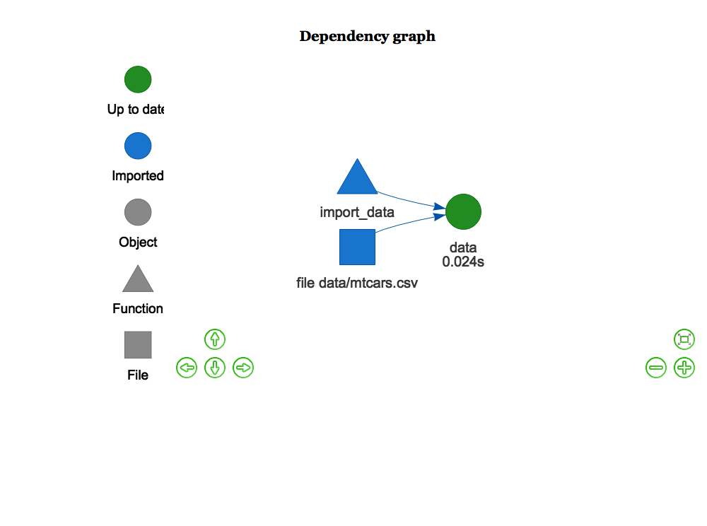

<!-- README.md is generated from README.Rmd. Please edit that file -->

```{r, include = FALSE}
knitr::opts_chunk$set(
  eval = FALSE,
  collapse = TRUE,
  comment = "##"
)
```

Could we try something even simpler? What if we used the following make.R job script?

```{r}
library(drake)
library(readr)

import_data <- function(infile) {
  suppressMessages(read_csv(infile))
}

stopifnot(file.exists("data/mtcars.csv"))
plan <- drake_plan(data = import_data(file_in("data/mtcars.csv")))
prefix <- paste(Sys.info()["nodename"], proc.time()["elapsed"], stringi::stri_rand_strings(1, 10), sep = "-")

make(
  plan,
  cache_log_file = paste0(prefix, "-cache.log"),
  console_log_file = paste0(prefix, "-console.log") # much more useful post-#808
)

config <- drake_config(plan)
vis_drake_graph(config, file = paste0(prefix, ".png")) # requires webshot::install_phantomjs() first
```

Standard `make()` in fresh session/cache.

```{r}
if (dir.exists(".drake")) unlink(".drake", recursive = TRUE)
callr::rscript("make.R", show = TRUE)
```

- [console.log](MPD25W6041J1GP-0.298-wr9WCH2M5O-console.log)
- [cache.log](MPD25W6041J1GP-0.298-wr9WCH2M5O-cache.log)


What do the results look like if you run the following with a fresh session and cache?

```{r}
if (dir.exists(".drake")) unlink(".drake", recursive = TRUE)
rstudioapi::jobRunScript("make.R", workingDir = getwd())
```

- [console.log](MPD25W6041J1GP-0.35-cJIo9QP0I4-console.log)
- [cache.log](MPD25W6041J1GP-0.35-cJIo9QP0I4-cache.log)



Everything is up-to-date when running `make()` again from a normal session.

```{r}
callr::rscript("make.R", show = TRUE)
```

- [console.log](MPD25W6041J1GP-0.295-2jhLyJRX2F-console.log)
- [cache.log](MPD25W6041J1GP-0.295-2jhLyJRX2F-cache.log)


