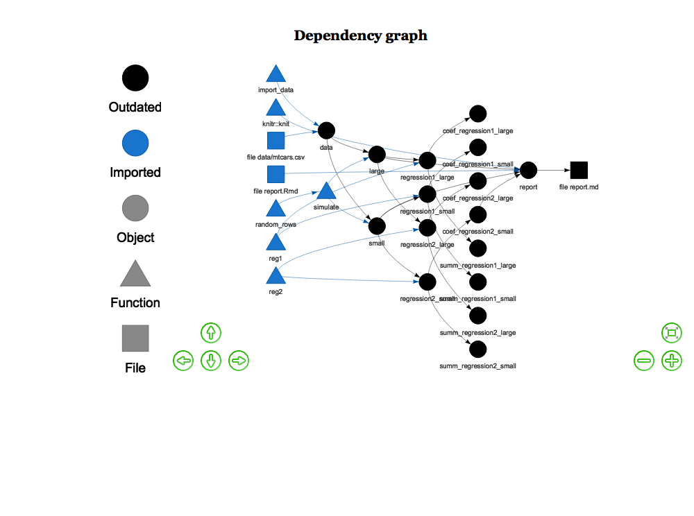
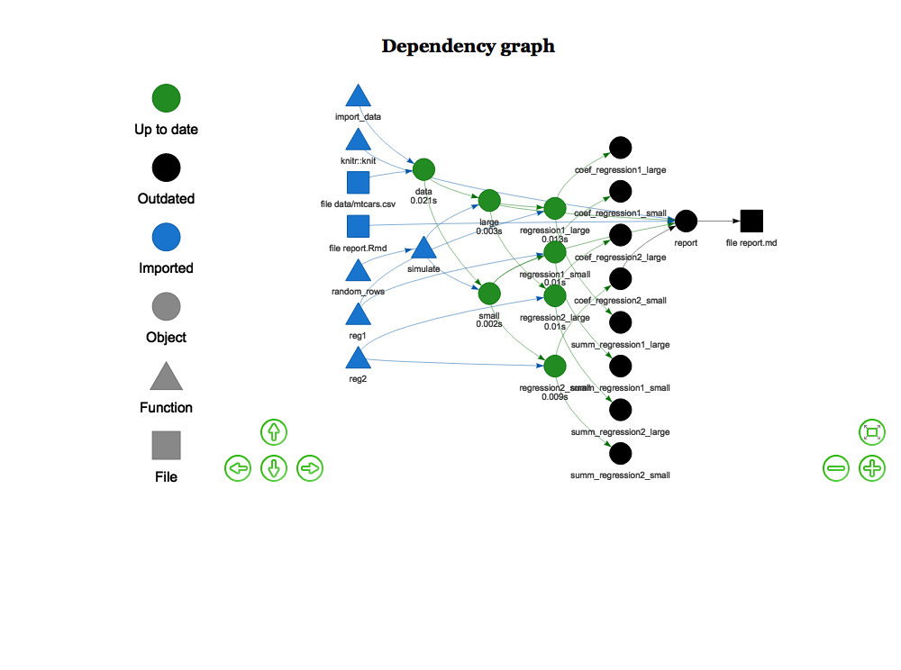

<!-- README.md is generated from README.Rmd. Please edit that file -->

Could we try something even simpler? What the plan and all dependencies
are contained in single file [make.R](make.R)?

Note that `make.R` includes logic to build up to and including the
regression targets if they are out of date, otherwise to build
everything.

## Standard Setup

Standard `make()` in fresh session/cache.

``` r
if (dir.exists(".drake")) unlink(".drake", recursive = TRUE)
callr::rscript("make.R", show = TRUE)
callr::rscript("make.R", show = TRUE)
```

### Step 1



`console.log`

    target data
    target large
    target small
    target regression1_large
    target regression2_large
    target regression1_small
    target regression2_small

`cache.log`

    hash type name
    a7afcfc52a180687 target data
    a44bdd51b1e985e3 import import_data
    7b6504d4c0dcceab target large
    503a24ae76dad431 import knitr::knit
    e48820305a44c4d2 import file data/mtcars.csv
    7a456ee58df699be import file report.Rmd
    db84c9f752635a13 import random_rows
    21935c86f12692e2 import reg1
    69ade4b78f15a3f9 import reg2
    e1501ed9d62b846e target regression1_large
    2a400716e73eac8f target regression1_small
    fe8ac4561279fb68 target regression2_large
    c0f94be64233efe8 target regression2_small
    9b31e33768015e24 import simulate
    78414659cd5e9997 target small

### Step 2


`console.log`

    target coef_regression2_small
    target summ_regression1_large
    target summ_regression1_small
    target summ_regression2_large
    target summ_regression2_small
    target coef_regression1_large
    target coef_regression1_small
    target coef_regression2_large
    target report

`cache.log`

    hash type name
    4e6e4d4c0bcda263 target coef_regression1_large
    5ad25785a84e0cac target coef_regression1_small
    b2662785d55b28c1 target coef_regression2_large
    23c66b36be56905b target coef_regression2_small
    a7afcfc52a180687 target data
    a44bdd51b1e985e3 import import_data
    7b6504d4c0dcceab target large
    503a24ae76dad431 import knitr::knit
    e48820305a44c4d2 import file data/mtcars.csv
    7a456ee58df699be import file report.Rmd
    fa9a77f4ba63574e target file report.md
    db84c9f752635a13 import random_rows
    21935c86f12692e2 import reg1
    69ade4b78f15a3f9 import reg2
    e1501ed9d62b846e target regression1_large
    2a400716e73eac8f target regression1_small
    fe8ac4561279fb68 target regression2_large
    c0f94be64233efe8 target regression2_small
    f3bb623354b52fa1 target report
    9b31e33768015e24 import simulate
    78414659cd5e9997 target small
    065f93613f1cb914 target summ_regression1_large
    2362318068e2692d target summ_regression1_small
    c2c95619e31d7fa8 target summ_regression2_large
    c7dc974fa996335f target summ_regression2_small

## RStudio Job Launcher

What do the results look like if you run the following with a fresh
session and cache?

``` r
if (dir.exists(".drake")) unlink(".drake", recursive = TRUE)
# Step 1
rstudioapi::jobRunScript("make.R", workingDir = getwd())

# Step 2
callr::rscript("make.R", show = TRUE)
```

### Step 1


`console.log`

    target data
    target large
    target small
    target regression1_large
    target regression2_large
    target regression1_small
    target regression2_small

`cache.log`

    hash type name
    a7afcfc52a180687 target data
    a44bdd51b1e985e3 import import_data
    7b6504d4c0dcceab target large
    503a24ae76dad431 import knitr::knit
    e48820305a44c4d2 import file data/mtcars.csv
    7a456ee58df699be import file report.Rmd
    db84c9f752635a13 import random_rows
    21935c86f12692e2 import reg1
    69ade4b78f15a3f9 import reg2
    72b5a6802f8a5264 target regression1_large
    4836a115e7d1e2c2 target regression1_small
    b95c5b5c4dc64e08 target regression2_large
    77b7266d12d7258e target regression2_small
    9b31e33768015e24 import simulate
    78414659cd5e9997 target small

### Step 2



`console.log`

    target coef_regression2_small
    target summ_regression1_large
    target summ_regression1_small
    target summ_regression2_large
    target summ_regression2_small
    target coef_regression1_large
    target coef_regression1_small
    target coef_regression2_large
    target report

`cache.log`

    hash type name
    4e6e4d4c0bcda263 target coef_regression1_large
    5ad25785a84e0cac target coef_regression1_small
    b2662785d55b28c1 target coef_regression2_large
    23c66b36be56905b target coef_regression2_small
    a7afcfc52a180687 target data
    a44bdd51b1e985e3 import import_data
    7b6504d4c0dcceab target large
    503a24ae76dad431 import knitr::knit
    e48820305a44c4d2 import file data/mtcars.csv
    7a456ee58df699be import file report.Rmd
    fa9a77f4ba63574e target file report.md
    db84c9f752635a13 import random_rows
    21935c86f12692e2 import reg1
    69ade4b78f15a3f9 import reg2
    72b5a6802f8a5264 target regression1_large
    4836a115e7d1e2c2 target regression1_small
    b95c5b5c4dc64e08 target regression2_large
    77b7266d12d7258e target regression2_small
    f3bb623354b52fa1 target report
    9b31e33768015e24 import simulate
    78414659cd5e9997 target small
    065f93613f1cb914 target summ_regression1_large
    2362318068e2692d target summ_regression1_small
    c2c95619e31d7fa8 target summ_regression2_large
    c7dc974fa996335f target summ_regression2_small

## Results

Both of the above work as expected — as long as `make.R` doesn’t source
any external functions, everything exists in the same environment\!
